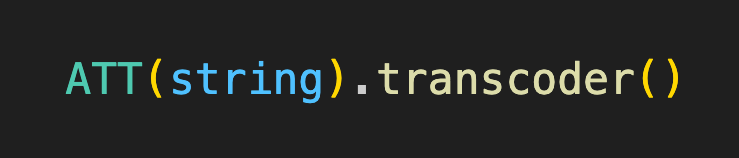

<p align="center">
  
</p>

<h1 align="center">ATT String Transcoder</h1>

<p align="center">
  
  
  
  
  <a href="CODE-OF-CONDUCT.md"></a>
</p>

---

Allows you to decode _A Township Tale_'s save strings for analysing, and encode JS objects into ATT save strings for spawning.

⚠️ Use this library primarily when creating bots for ATT, or when building your own ATT save string project. **If you just want to make string weapons, check out our [ATT String Workshop](https://github.com/mdingena/att-string-workshop) project.**

## Join the community

Join the ATT string creators community for sharing and troubleshooting strings built with _ATT String Transcoder_.

<a href="https://discord.gg/XXCMeHvff7" target="_blank"></a>

## :sparkles: Quickstart

### Installation

Add this library to your project's dependencies:

```shell
npm install --save att-string-transcoder
```

### Usage

```ts
import { Prefab } from 'att-string-transcoder';

const blade = new Prefab('Large_Longsword_Blade').setMaterial('Mythril');

const handle = new Prefab('Handle_Short_Cool')
  .addChildPrefab('Slot_Large_SwordType_Craft_33946', blade)
  .setKinematic()
  .print();
```

Read the [API Reference Documentation](docs/README.md) for more options.
